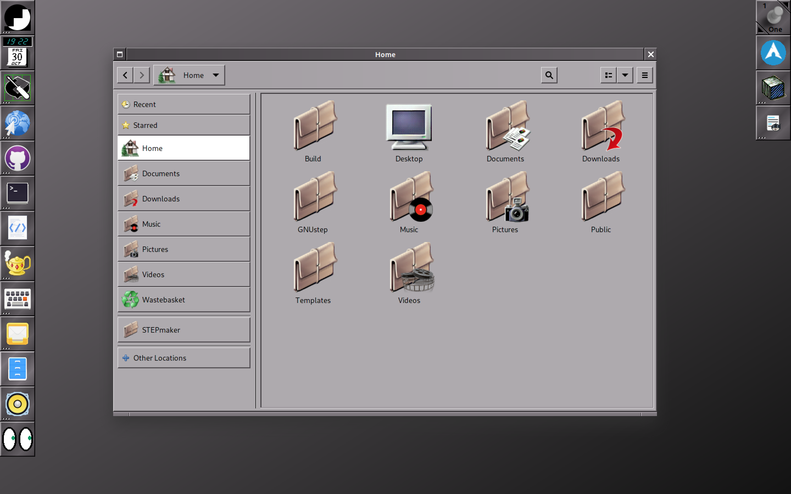

# STEPmaker

I like Gnome, I like NeXTSTEP. They have something in common. Simple and beautiful. I want to combine them with the WindowMaker as the window maker... I'm a WindowMaker user since the late 90's and I see great fun to keep my old style of using my computer the same.

This is my STEPmaker project to combine them.

